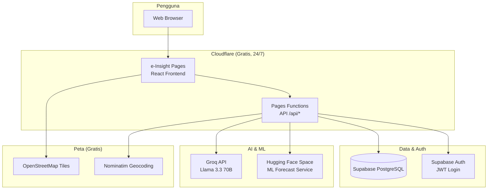

e-Insight

Integrated Violence Case Management & Decision Support System

Version 1.0 • July 2026

Platform  
https://e-insight.pages.dev

Development Team  
@budi  
@Henokhvita

---

## 1. Ringkasan Eksekutif

Sistem e-Insight dibangun sebagai aplikasi web berbasis **React** yang di-host di **Cloudflare Pages**, dengan backend serverless (**Cloudflare Pages Functions**), database cloud (**Supabase PostgreSQL**), layanan kecerdasan buatan (**Groq LLM**), dan layanan prediksi machine learning (**Hugging Face Spaces**). Visualisasi data dan laporan BI diimplementasikan secara **built-in** menggunakan **Apache ECharts**, sehingga tidak memerlukan lisensi Power BI atau hosting Metabase terpisah.

---

## 2. Diagram Arsitektur Sistem



### 2.1 Alur Data Utama

1. Pengguna login via **Supabase Auth** → token JWT disimpan di browser.
2. Frontend memanggil **Pages Functions** (`/api/cases`, `/api/analytics`, dll.) dengan bearer token.
3. Functions memvalidasi token, mengambil/menulis data di **Supabase**.
4. Modul **Forecasting** memanggil **Hugging Face ML Service** untuk prediksi time-series.
5. Modul **AI Insight** memanggil **Groq API** untuk narasi dan rekomendasi.
6. Modul **GIS** menampilkan peta dari **Leaflet + OpenStreetMap**.

---

## 3. Tabel Software & Plugin Aktif

### 3.1 Layanan Cloud & Hosting

| No | Software / Layanan | Versi | Status | Manfaat & Fungsi |
|----|-------------------|-------|--------|------------------|
| 1 | Cloudflare Pages | — | Aktif 24/7 | Hosting frontend React, CDN global, HTTPS otomatis |
| 2 | Cloudflare Pages Functions | nodejs_compat_v2 | Aktif 24/7 | Backend API serverless tanpa VPS |
| 3 | Wrangler CLI | — | Aktif | Deploy aplikasi & pengelolaan secret |
| 4 | Supabase | — | Aktif 24/7 | Database PostgreSQL cloud + autentikasi |
| 5 | Groq API | Llama 3.3 70B | Aktif 24/7 | LLM untuk AI Insight & chat analitik |
| 6 | Hugging Face Spaces | Docker SDK | Aktif 24/7 | Hosting layanan ML forecast Python |

### 3.2 Framework & Bahasa Pemrograman

| No | Software | Versi | Status | Manfaat & Fungsi |
|----|----------|-------|--------|------------------|
| 7 | React | 19.x | Aktif | Antarmuka pengguna interaktif |
| 8 | TypeScript | 5–6.x | Aktif | Type safety di seluruh codebase |
| 9 | Vite | 8.x | Aktif | Build tool & dev server frontend |
| 10 | FastAPI | 0.115+ | Aktif | Framework API layanan ML |
| 11 | NestJS | 11.x | Dev lokal | Backend lengkap untuk pengembangan lokal |
| 12 | Python | 3.x | Aktif | Runtime layanan machine learning |

### 3.3 Frontend & Komponen UI

| No | Plugin / Library | Status | Manfaat & Fungsi |
|----|------------------|--------|------------------|
| 13 | Tailwind CSS | Aktif | Styling responsif & tema modern |
| 14 | Radix UI | Aktif | Komponen aksesibel (dialog, tabs, dropdown) |
| 15 | Lucide React | Aktif | Ikon navigasi & KPI |
| 16 | Framer Motion | Aktif | Animasi transisi halaman |
| 17 | React Router | Aktif | Routing antar modul aplikasi |
| 18 | TanStack React Query | Aktif | Cache & refresh data API otomatis |
| 19 | Axios | Aktif | HTTP client dengan autentikasi JWT |

### 3.4 Database & Autentikasi

| No | Plugin / Layanan | Status | Manfaat & Fungsi |
|----|------------------|--------|------------------|
| 20 | Supabase Auth | Aktif | Login, registrasi, manajemen session |
| 21 | @supabase/supabase-js | Aktif | Klien database & auth |
| 22 | PostgreSQL | Aktif | Penyimpanan kasus SIMPATI.KK, profil, audit |
| 23 | Role-Based Access Control | Aktif | Pembatasan akses admin/operator/auditor |

### 3.5 Machine Learning & Kecerdasan Buatan

| No | Software / Model | Status | Manfaat & Fungsi |
|----|------------------|--------|------------------|
| 24 | Groq — Llama 3.3 70B Versatile | Aktif | Ringkasan eksekutif, rekomendasi strategis |
| 25 | scikit-learn | Aktif | Random Forest & neural network (LSTM surrogate) |
| 26 | XGBoost | Aktif | Regresi prediksi kasus time-series |
| 27 | Prophet (Facebook) | Opsional | Forecast musiman (jika library tersedia) |
| 28 | Hybrid Forecast Model | Aktif | Ensemble otomatis multi-model |
| 29 | pandas & numpy | Aktif | Pra-pemrosesan data time-series |

### 3.6 Analitik & Visualisasi (Pengganti Metabase)

| No | Software / Modul | Status | Manfaat & Fungsi |
|----|------------------|--------|------------------|
| 30 | Apache ECharts | Aktif | Chart interaktif (bar, line, pie, heatmap, dll.) |
| 31 | echarts-for-react | Aktif | Integrasi chart ke komponen React |
| 32 | Modul Dashboard | Aktif | KPI total kasus, aktif, selesai, tren |
| 33 | Modul Analitik | Aktif | Pareto, treemap, Sankey, funnel, scatter, bubble |
| 34 | Modul Laporan | Aktif | Report builder & export PDF |
| 35 | Metabase OSS | Tidak aktif | Menu disembunyikan; tidak di-deploy cloud |
| 36 | Power BI | Tidak aktif | Alternatif berbayar; belum dikonfigurasi |

### 3.7 GIS & Pemetaan

| No | Software | Status | Manfaat & Fungsi |
|----|----------|--------|------------------|
| 37 | Leaflet | Aktif | Peta interaktif modul GIS Intelligence |
| 38 | react-leaflet | Aktif | Binding peta ke React |
| 39 | leaflet.markercluster | Aktif | Cluster titik kasus di peta |
| 40 | leaflet.heat | Aktif | Heatmap kepadatan kasus |
| 41 | leaflet-draw | Aktif | Gambar polygon/area analisis |
| 42 | @turf/turf | Aktif | Analisis geospasial |
| 43 | OpenStreetMap | Aktif | Basemap peta gratis |
| 44 | Esri World Imagery | Aktif | Basemap satelit |
| 45 | Nominatim | Aktif | Geocoding alamat Indonesia |

### 3.8 Keamanan & Administrasi

| No | Fitur / Plugin | Status | Manfaat & Fungsi |
|----|----------------|--------|------------------|
| 46 | RBAC (Role-Based Access) | Aktif | Kontrol akses per peran pengguna |
| 47 | Data Scope Filtering | Aktif | Pembatasan data per wilayah |
| 48 | PII Masking & Reveal | Aktif | Perlindungan data sensitif korban |
| 49 | Audit Trail | Aktif | Pencatatan aktivitas pengguna |
| 50 | MFA (TOTP/Email OTP) | UI saja | Antarmuka ada; verifikasi belum aktif di production |

### 3.9 Import Data & Laporan

| No | Software | Status | Manfaat & Fungsi |
|----|----------|--------|------------------|
| 51 | xlsx (SheetJS) | Aktif | Import logbook Excel SIMPATI.KK |
| 52 | csv-parse | Aktif | Parsing file CSV |
| 53 | html2canvas | Aktif | Export laporan ke gambar/PDF |

---

## 4. Modul Aplikasi e-Insight

| Modul | Path URL | Fungsi Utama |
|-------|----------|--------------|
| Dashboard | `/` | Ringkasan KPI dan tren kasus |
| Pendampingan | `/pendampingan` | Manajemen kasus pendampingan |
| Data Historis | `/data-historis` | Arsip dan riwayat data |
| Import Data | `/import` | Unggah logbook Excel ke Supabase |
| Analitik | `/analitik` | Visualisasi multi-chart interaktif |
| GIS Intelligence | `/gis` | Peta sebaran kasus & analisis spasial |
| AI Insight | `/ai-insight` | Narasi AI & chat analitik |
| Forecasting | `/forecasting` | Prediksi kasus dengan ML |
| Laporan | `/laporan` | Pembuatan & export laporan |
| Admin & Security | `/admin` | Manajemen user, audit, keamanan |
| Master Data | `/master-data` | Data referensi sistem |
| Pengaturan | `/pengaturan` | Konfigurasi aplikasi |

---

## 5. Topologi Deployment Production

```
┌─────────────────────────────────────────────────────────────┐
│                    PENGGUNA (Browser)                        │
└─────────────────────────┬───────────────────────────────────┘
                          │ HTTPS
┌─────────────────────────▼───────────────────────────────────┐
│              Cloudflare Pages (e-insight.pages.dev)          │
│  ┌─────────────────────┐  ┌─────────────────────────────┐ │
│  │  React Frontend     │  │  Pages Functions (/api/*)   │ │
│  │  (Vite build)       │  │  TypeScript serverless       │ │
│  └─────────────────────┘  └──────────┬──────────────────┘ │
└──────────────────────────────────────┼──────────────────────┘
                                       │
          ┌────────────────────────────┼────────────────────────┐
          │                            │                        │
          ▼                            ▼                        ▼
   ┌─────────────┐            ┌─────────────────┐      ┌────────────────┐
   │  Supabase   │            │   Groq API      │      │ Hugging Face   │
   │  PostgreSQL │            │  Llama 3.3 70B  │      │ ML Space       │
   │  + Auth     │            │  (AI Insight)   │      │ (Forecasting)  │
   └─────────────┘            └─────────────────┘      └────────────────┘
```

**Karakteristik deployment:**
- Tidak memerlukan VPS atau server dedicated
- Biaya operasional: **gratis** (tier free Cloudflare, Supabase, Groq, Hugging Face)
- Ketersediaan: **24/7** untuk komponen production
- Tidak memerlukan kartu kredit untuk stack aktif saat ini

---

## 6. Perbandingan: Stack Aktif vs Alternatif yang Tidak Dipakai

| Komponen | Yang Dipakai (Aktif) | Alternatif | Alasan Tidak Dipakai |
|----------|----------------------|------------|----------------------|
| BI Dashboard | ECharts built-in | Metabase OSS | Butuh self-host/VPS; menu disembunyikan |
| BI Dashboard | ECharts built-in | Power BI | Berbayar untuk embed production |
| Hosting API | Cloudflare Functions | Render/Railway VPS | Gratis tanpa kartu di CF Pages |
| Hosting ML | Hugging Face Spaces | VPS Oracle/Fly.io | Butuh verifikasi kartu kredit |
| Database | Supabase | PostgreSQL self-host | Managed, gratis, terintegrasi auth |

---

## 7. Kesimpulan

Sistem e-Insight mengimplementasikan arsitektur **serverless cloud-native** yang menggabungkan:

1. **Presentation layer** — React + Tailwind + ECharts di Cloudflare Pages  
2. **Application layer** — Cloudflare Pages Functions (TypeScript)  
3. **Data layer** — Supabase PostgreSQL + Auth  
4. **Intelligence layer** — Groq LLM + Hugging Face ML Service  
5. **Geospatial layer** — Leaflet + OpenStreetMap  

Pendekatan ini memenuhi kebutuhan **Decision Support System** untuk SIMPATI.KK dengan biaya operasional minimal (gratis), ketersediaan 24/7, dan visualisasi data yang setara fungsi Metabase tanpa ketergantungan pada tool BI berbayar.

---

*Dokumen ini dapat disertakan sebagai Lampiran Teknis pada Bab Implementasi / Lampiran Skripsi.*

**Cara export ke Word/PDF:**
1. Buka file ini di VS Code / Cursor
2. Install ekstensi "Markdown PDF" atau buka di [Pandoc](https://pandoc.org)
3. Perintah Pandoc: `pandoc LAMPIRAN-STACK-E-INSIGHT.md -o LAMPIRAN-STACK-E-INSIGHT.docx`
